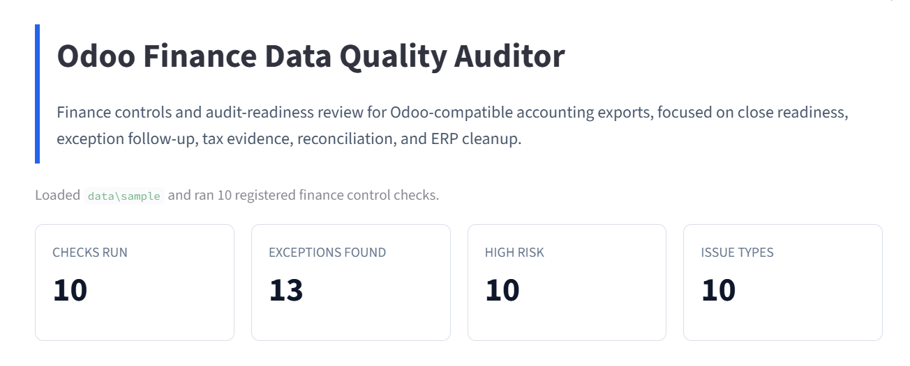
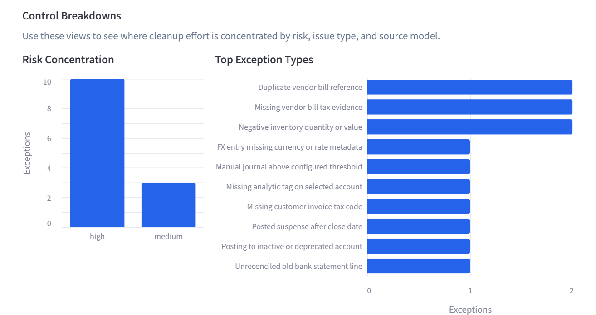
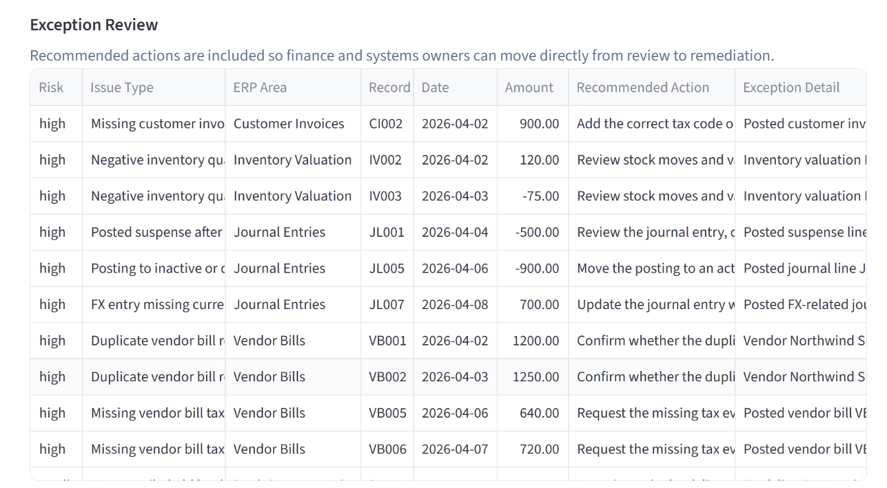
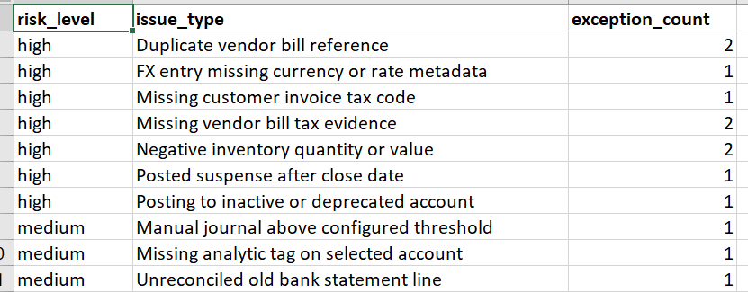
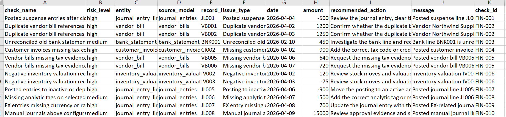

# Odoo Finance Data Quality Auditor

[](https://www.python.org/)
[](https://github.com/Chezhira/Odoo-Finance-Data-Quality-Auditor/actions/workflows/ci.yml)
[](pyproject.toml)
[](https://streamlit.io/)

A finance controls and audit-readiness tool for reviewing Odoo-compatible accounting exports. The project validates ERP finance data, flags control exceptions, and produces an Excel exception workbook for finance, audit, and systems cleanup workflows.

Live demo: [https://odoo-finance-data-quality-auditor.streamlit.app/](https://odoo-finance-data-quality-auditor.streamlit.app/)

## Why It Matters

Finance teams need a practical way to assess close readiness, audit trail quality, reconciliation follow-up, tax evidence gaps, inventory valuation issues, and ERP cleanup priorities. This project turns representative ERP finance data extracts into a structured exception review that can be used by finance, audit, and systems teams.

## Target Users

- finance systems analysts reviewing ERP data quality before close
- Odoo functional consultants validating accounting configuration and cleanup needs
- ERP business analysts preparing audit-readiness or reconciliation follow-up packs
- accounting systems consultants assessing controls, evidence, and exception remediation

## Key Features

- 10 registered finance validation checks with risk level, source model, and recommended action metadata
- Streamlit dashboard for executive-facing exception review
- Excel exception workbook with summary and detailed remediation tabs
- CLI workflow for repeatable validation and report generation
- pytest coverage for loader validation, rule behavior, dashboard helpers, and workbook export
- GitHub Actions workflow for tests and sample-data smoke validation

## Screenshots

The screenshots below show the bundled sample-data workflow. The deployed app also supports CSV upload mode for Odoo-compatible accounting exports.

### Dashboard Overview



### Control Breakdowns



### Exception Review



### Excel Exception Workbook





## Current Validation Checks

The validation engine currently runs 10 registered checks:

1. Posted suspense entries after the finance close date
2. Duplicate vendor bill references for the same vendor
3. Unreconciled bank statement lines older than the configured threshold
4. Customer invoices with missing tax codes
5. Vendor bills with missing tax evidence fields
6. Inventory valuation records with negative quantity or negative value
7. Posted journal entries to inactive or deprecated accounts
8. Missing analytic tags on selected expense or project accounts
9. FX entries missing currency or exchange rate metadata
10. Manual journals above the configured review threshold

Each check is defined in a central registry with its name, description, risk level, source model, and recommended action. The CLI and dashboard both use the registry so check counts stay aligned with the implemented controls.

## Dashboard

The Streamlit dashboard provides a finance control tower style review screen for ERP data quality and audit-readiness review. It includes:

- a default bundled sample-data mode for exploring the dashboard immediately
- an upload mode for running checks against Odoo-compatible CSV exports
- KPI cards for checks run, exceptions found, high-risk exceptions, and issue types
- risk concentration, top exception type, and affected ERP area breakdowns
- filters for risk level, issue type, and ERP area
- detailed exception review with recommended remediation actions
- Excel workbook download for the current filtered exception population

Open the live dashboard:

[https://odoo-finance-data-quality-auditor.streamlit.app/](https://odoo-finance-data-quality-auditor.streamlit.app/)

Run the dashboard with:

```powershell
$env:PYTHONPATH='src'; streamlit run app.py
```

Then open [http://localhost:8501](http://localhost:8501/).

### Dashboard Data Modes

**Sample data mode** uses bundled sample ERP finance exports so reviewers can explore the workflow safely. This mode currently runs 10 checks and produces 13 exceptions.

**CSV upload mode** allows users to upload Odoo-compatible CSV files. It runs the same validation engine and produces the same KPI cards, control breakdowns, exception review table, and Excel exception workbook.

Upload mode expects these filenames:

- `accounts.csv`
- `journal_entries.csv`
- `vendor_bills.csv`
- `customer_invoices.csv`
- `inventory_valuation.csv`
- `bank_statement_lines.csv`

The app matches uploaded files by filename and shows which required files are still missing before running the audit.

## Excel Exception Workbook

The CLI and dashboard both produce an exception review workbook with:

- `Summary`: exception counts by risk level and issue type
- `Exceptions`: check name, risk level, entity, source model, record ID, issue type, date, amount, recommended action, message, check ID, and metadata

With the included sample data, the validation run currently executes 10 checks and produces 13 intentionally triggered exceptions.

## Installation

```powershell
python -m venv .venv
.\.venv\Scripts\python.exe -m pip install -e ".[dev]"
```

## CLI Usage

```powershell
$env:PYTHONPATH='src'; python -m odoo_finance_data_auditor.cli --sample-data data\sample --output reports\sample_exception_report.xlsx
```

Binary Excel outputs are intentionally ignored by git through `reports/*.xlsx`. Regenerate the sample exception workbook at any time with the CLI command above.

## Testing And CI

Run the test suite with:

```powershell
python -m pytest --basetemp .pytest-tmp
```

The GitHub Actions workflow installs the package, runs pytest, and performs a sample-data CLI smoke test so the validation engine and workbook export stay reliable.

## Sample Data And Privacy

The public Streamlit deployment is intended for demonstration and portfolio review. Use the bundled sample data to explore the workflow. If testing upload mode, do not upload confidential client, employer, or production data.

Uploaded files are processed for the active session. This repository includes synthetic sample data for demonstration and testing purposes; the sample files are designed to resemble common Odoo finance exports, but they do not contain employer, client, or production data.

Generated reports are written under `reports/` and ignored by git, except for `reports/.gitkeep`.

## Portfolio Signal

This project demonstrates:

- finance systems judgement across close readiness, tax evidence, reconciliation, inventory valuation, and ERP cleanup
- Odoo and ERP accounting data understanding
- audit-style exception reporting with recommended actions
- automated validation discipline with positive and negative pytest coverage
- CI/CD-backed delivery with repeatable smoke tests
- practical finance engineering for Odoo Functional Consultant, ERP Business Analyst, Finance Systems Analyst, and Accounting Systems Consultant roles

## Roadmap

- configurable rule thresholds
- company-specific rule profiles
- Odoo API connector
- scheduled exception emails
- AI-assisted remediation notes
